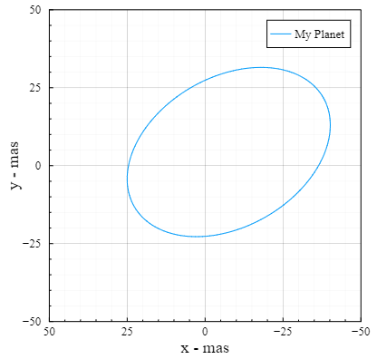

# DirectOrbits.jl

Tools for solving Keplerian orbits in the context of direct imaging.
The primary use case is mapping Keplerian orbital elements into Cartesian
coordinates at different times. A Plots.jl recipe is included for easily plotting orbits.

You can combine this package with Distributions.jl for uncertanties
in each parameter, and also one of the MCMC packages like AffineInvariantMCMC.jl
for sampling orbits. The performance of this package is quite good, so it 
is reasonable to generate millions of orbits drawn from Distributions.jl
as part of a orbital fit routine. Examples of this will be included here
in the future.

See also [DirectImages.jl](//github.com/sefffal/DirectImages.jl)

This is a pure Julia package with few dependencies, so it be compatible with a wide range of hardware and operating systems.


## Usage
```julia
using DirectOrbits

# See below for units and conventions on these parameters.
elements = KeplerianElementsDeg(a=1, i=45, e=0.25, τ=0, μ=1, ω=0, Ω=120, plx=35)

# Display one full period of the orbit (run `using Plots` first)
plot(elements, label="My Planet")
```


Note that by default the horizontal axis is flipped to match how it would look in the sky. The horizontal coordinates generated by these functions are not flipped in this way. If you use these coordinates to sample an image, you will have to either flip the image or negate the $x$ coordinate.

If you have an array of hundreds or thousands of orbits you want to visualize, just pass that array to `plot`. The opacity of the orbits will be reduced an appropriate amount.


Get projected cartesian coordinates in milliarcseconds at a given epoch:
```julia
julia> pos = kep2cart(elements, 1.0) # at time in days since τ, the epoch of periastron passage.
3-element SVector{3, Float64} with indices SOneTo(3):
  0.02003012254093835
  0.01072871196981525
 -0.019306398386215368
```


There are many convenience functions, including:
 - `period(elements)`:  period of a the companion in days.
 - `distance(elements)`:  distance to the system in pc
 - `meanmotion(elements)`: mean motion about the primary in radians/yr
 - `projectedseparation(elements, t)`: given orbital elements and a time, the projected separation between the primary and companion
 - `raoff(elements, t)`: as above, but only the offset in Right Ascension
 - `decoff(elements, t)`: as above, but only the offset in declination

Showing an orbital elements object at the REPL will print a useful summary like this:
```julia
julia> elements
KeplerianElements{Float64}
─────────────────────────
a   [au ] = 1.0
i   [°  ] = 45.0
e         = 0.25
τ         = 0.0
μ   [M⊙ ] = 1.0
ω   [°  ] = 0.0
Ω   [°  ] = 120.0
plx [mas] = 35.0
──────────────────────────
period      [yrs ] : 1.0
distance    [pc  ] : 28.6
mean motion [°/yr] : 360.0
```

SVectors are chosen for the return values for easy composition with `CoordinateTransforms.jl` and `ImageTransformations.jl` packages.


## Fitting Orbit from Astrometry (fast maximum likelihood)
This package supports performing a basic fit of an orbit to a set of measured astrometry points using Optim.jl.

Here is an example:
```julia
# Specify RA & DEC offsets in milliarcseconds
points = [
  252.974    -467.881
   -1.45954  -507.251
 -228.043    -455.374
 -405.491    -364.166
 -561.768    -202.455
 -643.925     -13.0994
 -690.258     144.236
 -681.024     321.03
 -614.649     484.681
 -551.645     595.775
]
# And the epochs at which they were recorded (days)
times = [
   48.16752434745902
 1200.2509791741873
 2211.3700988139303
 3067.435021153025
 4037.8281015157604
 5219.557151698917
 6108.645454016449
 7199.034316716181
 8322.191353379085
 9188.64413272279
]
# Set some static parameters we won't optimize
static = (;
    μ = 1,
    plx = 45,
)
# And initial values of the parameters we will optimize
initial = (;
    a = 25,
    i = 0.9,
    e = 0.6,
    τ = 200,
    ω = deg2rad(24),
    Ω = deg2rad(100)
)
# Perform the fit & record a trace of intermediate values for vizualization
bestfit, trace = DirectOrbits.fit_lsq(points, times, static, initial, trace=true)
# Takes around 50ms

julia> bestfit
KeplerianElements{Float64}
─────────────────────────
a   [au ] = 15.2
i   [°  ] = 28.4
e         = 0.193
τ         = 407.0
μ   [M⊙ ] = 1.0
ω   [°  ] = 41.8
Ω   [°  ] = 122.0
plx [mas] = 45.0
──────────────────────────
period      [yrs ] : 59.4
distance    [pc  ] : 22.2
mean motion [°/yr] : 6.06
──────────────────────────

# Visualizing 
initial_el = KeplerianElements(merge(initial, static)...)
using Plots; theme(:dao)
plot()
plot!(initial_el, legend=:topright, label="Initial");
plot!(trace, label="Trace", color=3)
plot!(bestfit, label="Converged", color=2)
scatter!(eachcol(points)..., color=:black, label="Astrometry")
scatter!([0], [0], marker=(:star, :black, 5,), label="")
```


## Fitting Orbit from Astrometry (Bayesian inference)
This package has a function powered by AffineInvariantMCMC to fit orbits to astrometry given some priors.

Here is an example:
```julia
# Specify RA & DEC offsets in milliarcseconds
points = [
   -53.8966   558.288
   193.322    499.376
   349.503    399.522
   488.883    240.472
   564.314      0.798135
   559.83    -169.187
   575.512   -405.611
   377.393   -523.155
   305.762   -722.36
   257.12    -824.54
]
times = range(0, 365.24*25, length=10)

# Specify the uncertainty on each point
uncertainty = fill(40.0, size(points))

using DirectOrbits
using Distributions

# We will keep these elements constant
static = (;
    μ = 1,
    ω = 0,
    Ω = 0,
    plx = 45,
)

# Define our priors using any Distrubtions
priors = (;
    a = TruncatedNormal(25, 4, 0., Inf),
    i = Normal(0.7, 0.3),
    e = TruncatedNormal(0.5, 0.2, 0.0, 1.0),
    τ = Normal(250, 200.0),
)

# Run 
chains = DirectOrbits.fit_bayes(priors, static, points, times, uncertainty, burnin=30_000, numsamples_perwalker=20_000)

# displaying chains will give summary statistics on all fitted elements
# You can also use StatsPlots for traceplots, histograms, basic corner plots, etc.
```


```julia
# Sample from posterior and make a nice plot
using Plots
N = 100
sampled = sample(KeplerianElements, chains, static, N)
plot()
scatter!(points[:,1], points[:,2], yerr=uncertainty[:,1], xerr=uncertainty[:,2], label="Astrometry", marker=(:black, :circle,1))
plot!(sampled, label="Posterior", color=1, alpha=0.05)
scatter!([0],[0], marker=(:star, :yellow,6),label="")
```


```julia
# Corner Plots via Python's corner package
using PyCall
corner = pyimport("corner")
import PyPlot # Necessary for plots to auto-display

# Reorganize the samples, subset every 10th, and plot.
prepared = hcat(
    chains[:a][:], # a
    chains[:e][:], # e
    rad2deg.(chains[:i][:]), # i
    chains[:τ][:], # τ
)
figure = corner.corner(
    prepared,
    labels=["a - au", "ecc", "inc - °", "τ - days"],
    quantiles=[0.16, 0.5, 0.84],
    show_titles=true, title_kwargs=Dict("fontsize"=>12),
);
display(figure)
```


## Units & Conventions

The main constructor, `KeplerianElements`, accepts the following parameters:
- `a`: Semi-major axis in astronomical units (AU)
- `i`: Inclination in radians
- `e`: Eccentricity in the range [0, 1)
- `τ`: Epoch of periastron passage, days.
- `μ`: Graviataion parameter of the central body, expressed in units of Solar mass.
- `ω`: Argument of periastron
- `Ω`: Longitude of the ascending node, radians.
- `plx`: Distance to the system expressed in milliarcseconds of parallax.

Since conventions for `τ` vary, we do not impose any particular reference system. `τ` in days is essentially just an offset on whatever `t` values you provide. If you are using a particular reference system and want `t` to be e.g. the current MJD, than `τ` should be
the epoch of periastron passage in MJD. Similarily, if you are using the convention that
`τ` is measured as a fraction of the orbital period at some reference epoch, you will have to calculate and make than conversion yourself.

Parameters can either be specified by position or as keyword arguments (but not a mix). Positional 
arguments are recommended if you are creating objects in a tight loop.

There is also a convenience constructor `KeplerianElementsDeg` that accepts `i`, `ω`, and `Ω` in units of degrees instead of radians.


See [this diagram](https://upload.wikimedia.org/wikipedia/commons/thumb/e/eb/Orbit1.svg/1110px-Orbit1.svg.png) from Wikipedia as a reference for the conventions used by this package (note ♈︎ is replaced by the celestial North pole).

## Installation

This package is not yet registered, so to install it, you must specify this repository.

From a Julia prompt, type `]` followed by `add https://github.com/sefffal/DirectOrbits.jl.git`

Alternatively, run `using Pkg; Pkg.add("https://github.com/sefffal/DirectOrbits.jl.git")`

That's it! If you want to run it through a gauntlet of tests, type `]` followed by `test DirectOrbits`

## Performance
On my 2017 Core i7 laptop, this library is able to calculate
a projected position from a set of orbital elements in just
45ns (circular orbit) or 270ns - 1.7 μs (moderate eccentricity).
It can even robustly solve highly eccentric orbits in under
3μs per position (e=0.99).

Sampling a position on a 2017 Core i7 laptop:
```julia
julia> el = KeplerianElements(
               a = 1,
               i = 0,
               e = 0,
               τ = 0,
               μ = 1,
               ω = 0,
               Ω = 0,
               plx = 1000,
           )
julia> @btime kep2cart($el, $0.0)
  45.390 ns (0 allocations: 0 bytes)
3-element SVector{3, Float64} with indices SOneTo(3):
   0.0
 999.9999999921652
   0.0
```
