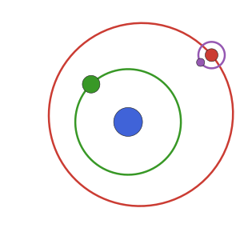

# PlanetOrbits.jl

[](https://sefffal.github.io/PlanetOrbits.jl/dev)
[](https://codecov.io/gh/sefffal/PlanetOrbits.jl)

Tools for solving Keplerian orbits in the context of direct imaging.
The primary use case is mapping Keplerian orbital elements into Cartesian
coordinates at different times. A Plots.jl recipe is included for easily plotting orbits.

Among other values, it calculates the projected positions of planets, as well as stellar radial velocity and proper motion anomaly. It's a great tool for visualizing different orbits (see examples) and generating nice animations (e.g. with Plots or Luxor.jl).

This package has been designed for good performance and composability with a wide range of packages in the Julia ecosystem, including ForwardDiff. 

To fit orbits to observations, see [DirectDetections.jl](https://github.com/sefffal/DirectDetections.jl).

## Usage
```julia
using PlanetOrbits

# See below for units and conventions on these parameters.
elements = KeplerianElementsDeg(a=1, i=45, e=0.25, τ=0, M=1, ω=0, Ω=120, plx=35)

# Display one full period of the orbit (run `using Plots` first)
using Plots
plot(elements, label="My Planet")
```


Note that by default the horizontal axis is flipped to match how it would look in the sky. The horizontal coordinates generated by these functions are not flipped in this way. If you use these coordinates to sample an image, you will have to either flip the image or negate the $x$ coordinate.

If you have an array of hundreds or thousands of orbits you want to visualize, just pass that array to `plot`. The opacity of the orbits will be reduced an appropriate amount.

Get projected cartesian coordinates in milliarcseconds at a given epoch:
```julia
julia> soln = orbitsolve(elements, 1.0) # at t time in modified julian days 
julia> raoff(soln) # Access components of the solution
julia> raoff(elements, 1.0) # Or compute just one component directly
```


There are many convenience functions, including:
 - `period(elements)`:  period of a the companion in days.
 - `distance(elements)`:  distance to the system in pc
 - `meanmotion(elements)`: mean motion about the primary in radians/yr
 - `projectedseparation(elements, t)`: given orbital elements and a time, the projected separation between the primary and companion
 - `raoff(elements, t)`: as above, but only the offset in Right Ascension (milliarcseconds)
 - `decoff(elements, t)`: as above, but only the offset in declination (milliarcseconds)
- `radvel`: radial velocity in m/s of the planet or star (see docstring)
- `propmotionanom`: proper motion anomaly of the star due to the planet in milliarseconds / year

Showing an orbital elements object at the REPL will print a useful summary like this:
```julia
julia> elements
KeplerianElements{Float64}
─────────────────────────
a   [au ] = 1.0
i   [°  ] = 45.0
e         = 0.25
τ         = 0.0
M   [M⊙ ] = 1.0
ω   [°  ] = 0.0
Ω   [°  ] = 120.0
plx [mas] = 35.0
──────────────────────────
period      [yrs ] : 1.0
distance    [pc  ] : 28.6
mean motion [°/yr] : 360.0
```
## Units & Conventions

The main constructor, `KeplerianElements`, accepts the following parameters:
- `a`: Semi-major axis in astronomical units (AU)
- `i`: Inclination in radians
- `e`: Eccentricity in the range [0, 1)
- `τ`: Epoch of periastron passage, in fraction of orbit [0,1]
- `M`: Graviataion parameter of the central body, expressed in units of Solar mass.
- `ω`: Argument of periastron
- `Ω`: Longitude of the ascending node, radians.
- `plx`: Distance to the system expressed in milliarcseconds of parallax.

Thee parameter `τ` represents the epoch of periastron passage as a  fraction of the planet's orbit between 0 and 1. This follows the same convention as Orbitize! and you can read more about their choice in ther FAQ.

Parameters can either be specified by position or as keyword arguments (but not a mix). Positional 
arguments are recommended if you are creating objects in a tight loop.

There is also a convenience constructor `KeplerianElementsDeg` that accepts `i`, `ω`, and `Ω` in units of degrees instead of radians.


See [this diagram](https://upload.wikimedia.org/wikipedia/commons/thumb/e/eb/Orbit1.svg/1110px-Orbit1.svg.png) from Wikipedia as a reference for the conventions used by this package (note ♈︎ is replaced by the celestial North pole).
<!-- 
## Image Warping
If you have an image of a system, you can warp the image as if each pixel were a test particle following Kepler's laws. 
This is an easy way to see what a disk or a system of planets would look like at a time other than when it was captured.

To make this possible, PlanetOrbits.jl can create `OrbitalTransformation` objects. These follow the conventions set out
in CoordinateTransformations.jl and are compatible with ImageTransformations.jl.

Example:
```julia
ot = OrbitalTransformation(
    i = 0.3,
    e = 0.1,
    M = 1.0,
    ω = 0.5,
    Ω = 0.5,
    plx = 30.0,
    
    platescale=10.0, # mas/px
    dt = 3*365.25 # days forward in time
)

img_centered = centered(img)
img_future = warp(img_centered, ot, axes(i))

# Display with DirectImages.jl
using DirectImages
imshow2([img; img_future], clims=(0,1), cmap=:seaborn_icefire_gradient)
```
**Before, and After Orbital Transformation**<br>


Note the arguments `platescale` and `dt` are required, but `a` and `τ` are not. The position of the pixel in X/Y space uniquely determines the semi-major axis and epoch of periastron passage when the rest of the orbital parameters are known. `platescale` in units of milliarseconds/pixel is necessary to get the overall scale of the transform correct. This is because an orbital transformation is **not** linear (and therefore, care must be taken when composing an OrbitalTransformation with other CoordinateTransformations). Scaling an image will change the amount of rotation that occurs at each separation. `dt` is the the amount of time in days to project the image forward. It can also be negative to project the image into the past. 
 -->

## Makie Recipe
There is a basic Makie plot recipe that allows you to plot a KeplerianElements:
```julia
using CairoMakie
elements = KeplerianElementsDeg(a=1, i=45, e=0.25, τ=0, M=1, ω=0, Ω=120, plx=35)
lines(elements, axis=(;autolimitaspect=1, xreversed=true))
```
Note that for Makie, you will have to reverse the x-axis manually whereas in Plots.jl it is set automatically.

## Installation
This package is not in the General registery, but a personal registry for this and related packages.
To install it, first add the DirectRegistry containing this, and other related packages:

(`]` to enter Pkg mode)
```julia
 pkg> registry add https://github.com/sefffal/DirectRegistry
 pkg> add PlanetOrbits
```

That's it! If you want to run it through a gauntlet of tests, type `]` followed by `test PlanetOrbits`

## Performance
On my 2017 Core i7 laptop, this library is able to calculate
a projected position from a set of orbital elements in just 48ns (circular orbit) or 166ns (eccentric).

All the helper functions should work without any heap allocations
when using standard numeric types.

Several parameters are pre-calculated when creating a KeplerianElements object. There is
therefore a slight advantage to re-use the same object if you are sampling many positions
from the same orbital elements (but we are only talking nanoseconds either way).

## Numerical Derivatives
This package works well with the autodiff package ForwardDiff.jl. For example:

```julia
using ForwardDiff
ForwardDiff.derivative(t -> radvel(elements, t), 123.0)
```

This has only a negligible overhead (maybe 15%) compared to calculating the value itself.
If you need access to both the value and the derivative, I recommend you use the DiffResults
package to calculate both at once for a 2x speedup:
```julia
using DiffResults
g = let elements=elements
    t -> raoff(elements, t)
end

# Set the result type
result_out = DiffResults.DiffResult(1.0,1.0)

# Calculate both the value and derivative at once
@btime res = ForwardDiff.derivative!($result_out, $g, 1.0)
#  205.487 ns (0 allocations: 0 bytes)

# Access each
rv = DiffResults.value(res)
drvdt = DiffResults.derivative(res, Val{1})
```

The Zygote reverse diff package does not currently work with PlanetOrbits.jl.

## Calculating orbits on a GPU 
Using the CUDA and StructArray packages, you can easily calculate ensembles of orbits on the GPU.

For example:
```julia
using PlanetOrbits
using StructArrays
using CUDA

# Create a vector of different initial conditions
elements = [KeplerianElementsDeg(
    a=1.0,
    i=45.,
    e=0.1,
    τ=0,
    ω=20,
    Ω=10,
    plx=50,
    M=3.0,
) for a in 1:0.01:10000]

# Convert the storage to a struct array instead of array of structs.
elements_sa = StructArray(elements)
# Send to GPU
elements_cusa = replace_storage(CuArray, elements_sa)

# Allocate output storage
out = zeros(length(elements_sa)) # CPU
out_cu = zeros(length(elements_cusa)) # GPU

# Calculate the radial velocity of each orbit at time zero
@time            out .= radvel.(elements_sa, 0.0) # CPU
@time CUDA.@sync out_cu .= radvel.(elements_cusa, 0.0) # GPU
```

On my laptop's pitiful GPU, the timing for the GPU calculation is still
17 times faster than on the CPU.


