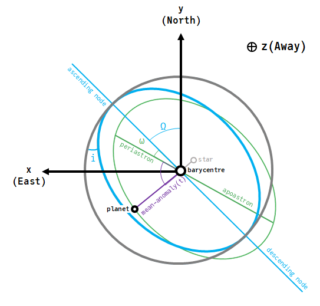

# Units & Conventions

The main constructor, [`VisualOrbit`](@ref), accepts the following parameters:
- `a`: Semi-major axis in astronomical units (AU)
- `i`: Inclination in radians
- `e`: Eccentricity in the range [0, 1)
- `τ`: Epoch of periastron passage, in fraction of orbit [0,1]
- `M`: Graviataion parameter of the central body, expressed in units of Solar mass.
- `ω`: Argument of periastron
- `Ω`: Longitude of the ascending node, radians.
- `plx`: Distance to the system expressed in milliarcseconds of parallax.

Thee parameter `τ` represents the epoch of periastron passage as a  fraction of the planet's orbit between 0 and 1. This follows the same convention as Orbitize! and you can read more about their choice in ther FAQ.

Parameters can either be specified by position or as keyword arguments (but not a mix).

See this PDF for a detailed derivation of projected position, velocity, and acceleration from these coordinates: [Derivation.pdf](assets/orbit_coordinate_notes.pdf)

There is also a convenience constructor [`VisualOrbitDeg`](@ref) that accepts `i`, `ω`, and `Ω` in units of degrees instead of radians.

This diagram shows a circular (gray), inclined (blue), and inclined eccentric (green) orbits described using the conventions of this package.

The $x$ variable increases to the left in the plane of the sky, consistent with right ascension that increases towards the East. The $y$ coordinate increases upwards towards the North. The $z$ coordinate increases away from the observer.

The ascending node is measured CCW in the plane of the sky starting from the $y$ (North) axis.

The location of the planet along its ellipse is measured along the green ellipse starting from periastron.
The parameter $\tau$ describes what fraction of the orbit the planet had completed at a chosen reference epoch, and therefore sets the location of the planet at a given time.