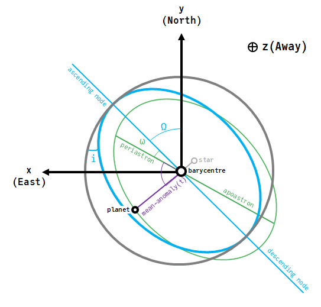

# Conventions

## Units

| quantity | unit |
|---|---|
| length / semi-major axis | AU |
| mass | solar masses (`msun`, `mjup`, `mearth` are exported multipliers) |
| angles | **radians** — no degree variants |
| epochs (`tp`, `epoch`, `ref_epoch`, solve times) | MJD |
| period (`P=`, `period(sys)`) | **days** |
| velocities (`velx`, Cartesian `vx`) | AU / julian year |
| radial velocity (`radvel`) | m/s |
| angular offsets (`raoff`, `decoff`) | mas |
| proper motion (`pmra`, `pmdec`) | mas / year |
| parallax (`plx`) | mas |
| frame `ra`, `dec` | degrees |
| frame `pmra`, `pmdec` | mas / year |
| frame `rv` | m/s |

Angles are radians and epochs are MJD everywhere, without exception. There are
no `_deg` variants — the conversion is one function call, and a second
spelling of every element is a bug surface.

There is deliberately **no units package**. Unit types are a performance
footgun in the hot loops this package targets. The exported mass constants
(`mass=1.2msun`, `mass=5.3mjup`, `mass=23mearth`) cover the case where
mistakes actually happen.

## The geometric convention

This diagram shows circular (gray), inclined (blue), and inclined eccentric
(green) orbits described using the conventions of this package.

The ``x`` variable increases to the left in the plane of the sky, consistent
with right ascension increasing towards the East. The ``y`` coordinate
increases upwards towards the North. The ``z`` coordinate increases away from
the observer.

The ascending node is measured counter-clockwise in the plane of the sky
starting from the ``y`` (North) axis.

The location of the body along its ellipse is measured from periastron. `tp`
is the epoch of closest approach and therefore sets the position at any time.
For bound orbits there are infinitely many equivalent `tp` values, related by
``t_p' = t_p + nP``.

See this PDF for a detailed derivation of projected position, velocity, and
acceleration from these coordinates:
[Derivation.pdf](assets/orbit_coordinate_notes.pdf)

## Elements

The canonical element set is `a, e, i, ω, Ω, tp`, spelled in Unicode. There are
no ASCII aliases; `i` stays `i`. Alternative parametrizations are constructor
*groups*, not aliases — see [Parametrizations](@ref).

**There is no `M` element.** Mass lives on `Body`, and an orbit's gravitating
mass is derived from the bodies it binds. This removes the long-standing
collision between `M` for total mass and `M` for mean anomaly, and removes the
manual per-planet mass bookkeeping users previously had to do by hand. `M=`
survives on `Orbit` strictly as a labelled compatibility escape hatch.

**Period is derived**, via `period(sys)`; it is not a field.

## Reference epochs are three distinct things

Never let one default to another:

- **`tp`** — the epoch of periastron passage. An orbital element.
- **`epoch`** — the epoch at which an `M0`, `θ`, or Cartesian state is
  measured. Usually chosen near the data.
- **`t0`** — the osculating epoch, `AHL21` only. Meaningless under
  `KeplerianApprox`, where elements are constant by construction.

The consequence worth repeating: the same element values mean different things
under the two propagators, so posteriors from one are not element-for-element
comparable with the other.

## Topology is static

The hierarchy is structure, not a random variable. Comparing two topologies is
discrete model comparison — two models sharing a variables block, compared by
evidence — not something to vary in-band during sampling.

## What is deliberately absent

- **`τ`** as a constructor keyword — it needs hidden period and reference-epoch
  state and has no clean meaning under N-body integration.
- **Degree variants** of any angle.
- **A units package.**
- **Macros.** The functional API is complete; Octofitter's model block is the
  single macro layer in the stack.
- **`System`, `Body` and `Orbit` in the export list** — Octofitter owns those
  three names unqualified. Import them explicitly or qualify them.
