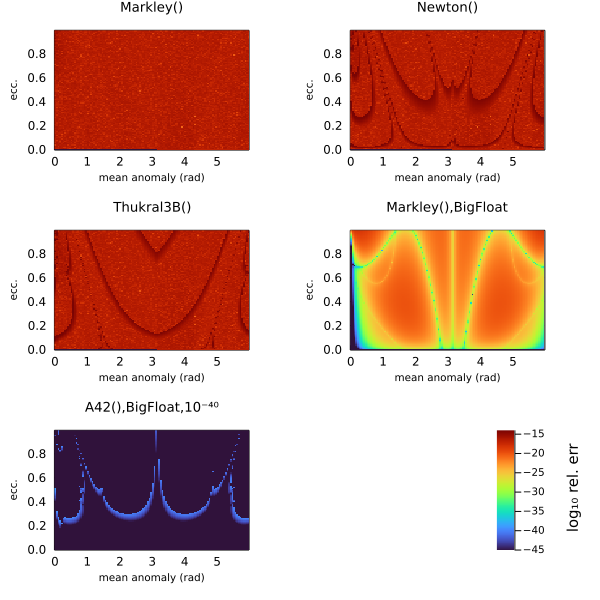
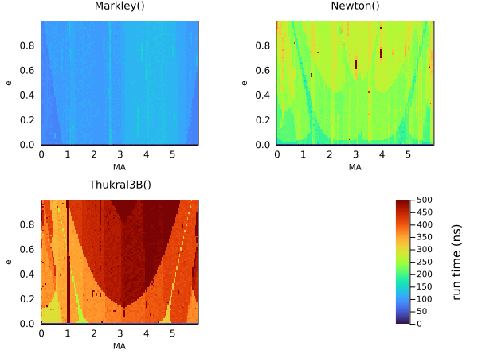

# Kepler Solvers

The heart of this package is being able to take a set of Keplerian elements and output relative positions, velocities, etc.

This normaly requires solving Kepler's equation numerically. This package supports a multitude of solver algorithms that can be passed to [`orbitsolve`](@ref):

* [`PlanetOrbits.Auto`](@ref)
* [`PlanetOrbits.Markley`](@ref)
* [`PlanetOrbits.Goat`](@ref)
* [`PlanetOrbits.RootsMethod`](@ref)

The last of these `RootsMethod`, allows one to substitute any algorithm from the Roots.jl package. These include many different classical and modern root finding algorithms.chosen precision, including artibrary precision BigFloats. Using big floats with, for example, `Roots.PlanetOrbits.Thukral5B` and a tight tolerenace, allows you to solve orbits up to arbitrary precision.

The default choice is `Auto`, which currently selects `Markley` for all cases. The Markley algorithm is very fast, reasonably accurate, and always converges, making it a good default choice.

The Markley algorithm is a tweaked version of the algorithm from [AstroLib.jl](http://juliaastro.github.io/AstroLib.jl/stable/ref/#AstroLib.kepler_solver). It is non-iterative and converges with less than 1e-15 relative error across the full range of e between 0 and 1.
On my laptop, this solves for a single eccentric anomaly in just 71 ns.
Since it is implemented in pure Julia, there is no overhead from calling into a C or Cython compiled function and no need for vectorization.

## Examples

```@example 1
using PlanetOrbits, BenchmarkTools
orb = orbit(a=1.2, e=0.1, M=1.0, ω=1.4, τ=0.5)
t = mjd("2025-06-23")
@benchmark orbitsolve(orb, t, PlanetOrbits.Markley())
```

```@example 1
@benchmark orbitsolve(orb, t, PlanetOrbits.Goat())
```


```@example 1
using Roots
@benchmark orbitsolve(orb, t, PlanetOrbits.RootsMethod(Roots.Newton()))
```

```@example 1
using Roots
@benchmark orbitsolve(orb, t, PlanetOrbits.RootsMethod(Roots.Thukral3B()))
```

```@example 1
@benchmark orbitsolve(orb, t, PlanetOrbits.RootsMethod(Roots.A42()))
```


```@example 1
@benchmark orbitsolve(orb, t, PlanetOrbits.RootsMethod(Roots.Bisection()))
```

```@example 1
@benchmark orbitsolve(orb, t, PlanetOrbits.RootsMethod(Roots.SuperHalley()))
```


```@example 1
@benchmark orbitsolve(orb, t, PlanetOrbits.RootsMethod(Roots.Brent()))
```

```@example 1
@benchmark orbitsolve(orb, t, PlanetOrbits.RootsMethod(Roots.Order2()))
```

```@example 1
@benchmark orbitsolve(orb, t, PlanetOrbits.RootsMethod(Roots.AlefeldPotraShi()))
```

## High precision
You can solve Kepler's equation in high precision using big floats and tightening the tolerance on the solver.


```@example 1
orb_big = orbit(a=big(1.2), e=big(0.1), M=big(1.0), ω=big(1.4), τ=big(0.5))
sol = orbitsolve(orb_big, big(t), PlanetOrbits.RootsMethod(Roots.Thukral5B(),rtol=1e-30,atol=1e-30,))
radvel(sol)
```


## Comparison


