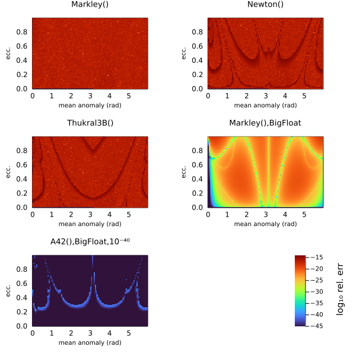
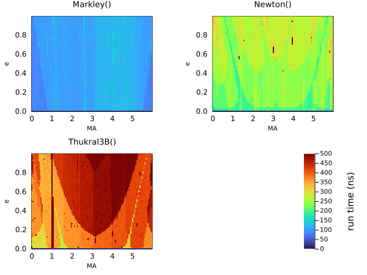

# Kepler solvers

Turning Keplerian elements into positions and velocities requires solving
Kepler's equation. Which algorithm is used is selectable through the
`KeplerianApprox` propagator:

```julia
orbitsolve(sys, epochs; method=KeplerianApprox(solver=PlanetOrbits.Markley()))
```

Available solvers:

* [`PlanetOrbits.Auto`](@ref) — the default
* [`PlanetOrbits.Markley`](@ref)
* [`PlanetOrbits.Goat`](@ref)
* [`PlanetOrbits.RootsMethod`](@ref)
* [`PlanetOrbits.HyperbolicHalley`](@ref)

`Auto` dispatches on eccentricity: `Markley` for `e < 1`, `HyperbolicHalley`
for `e > 1`. Both are non-iterative or fixed-iteration, allocation-free, and
always converge, which is what makes them safe defaults inside a sampler.

The Markley algorithm is a tweaked version of the one in
[AstroLib.jl](http://juliaastro.github.io/AstroLib.jl/stable/ref/#AstroLib.kepler_solver).
It is non-iterative and converges with less than 1e-15 relative error across
the full range of `e` between 0 and 1. Because it is pure Julia there is no
call overhead and no need for vectorization by hand.

`RootsMethod` wraps any algorithm from
[Roots.jl](https://github.com/JuliaMath/Roots.jl), which is the route to
arbitrary precision — but note that Roots allocates, so it is not suitable for
allocation-free hot loops.

## The SIMD batch path

`KeplerianApprox` solves each hierarchy row across *all* epochs at once. For
`Float64` systems using `Markley` or `Auto`, that batch runs through
branch-free kernels that vectorize across epochs — roughly 4× on AVX2, and
agreeing with the scalar solver to ≤ 4e-15. Other element types (e.g.
ForwardDiff `Dual`s) and other solvers are compile-time routed to the scalar
path.

Disable it with `KeplerianApprox(simd=false)` if you want to compare.

## Hyperbolic orbits

The hyperbolic Kepler equation `M = e·sinh(H) − H` is solved by a fixed
iteration count of Halley steps from a closed-form starting guess. Unlike a
Roots-based approach, this is allocation-free, so unbound orbits stay inside
the same performance contract as bound ones. It carries its own
implicit-differentiation rule, so ForwardDiff does not iterate through the
solver.

## High precision

Solve in arbitrary precision by building the system from `BigFloat` values and
tightening the solver tolerance:

```julia
using Roots
import PlanetOrbits as PO

A = PO.Body(mass=big(1.0), name=:A)
b = PO.Body(mass=big(0.0), name=:b)
sys = PO.System((A, b), (PO.Orbit(b, about=A; a=big(1.2), e=big(0.1), ω=big(1.4)),))

method = KeplerianApprox(
    solver=PlanetOrbits.RootsMethod(Roots.Thukral5B(), rtol=1e-30, atol=1e-30))
radvel(orbitsolve(sys, big(59000.0); method), :b, :A)
```

## Comparison




