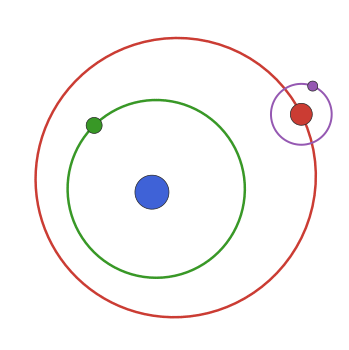

# Plotting

This package defines Plots.jl recipes for orbits and orbit solutions.
At its most basic, you can simply call `plot` on the object. The kind 
of plot will be based on the type of object. You can pass the `kind`
argument to control what plot is generated.

Examples:
```@example 1
using PlanetOrbits, Plots
orb = orbit(
    a=1.0,
    M=1.0,
)
plot(orb) # defaults to kind=:radvel
```

```@example 1
orb = orbit(
    a=1.0,
    M=1.0,
    i=0.5,
    Ω=4.5
)
plot(orb) # defaults to kind=(:x,:y)
```

```@example 1
orb = orbit(
    a=1.0,
    M=1.0,
    i=0.5,
    Ω=4.5,
    plx=120.0
)
plot(orb) # defaults to kind=:astrom
```

We can override:
```@example 1
plot(orb, kind=:radvel)
```
```@example 1
plot(orb, kind=(:x,:y))
```
```@example 1
plot(orb, kind=(:x,:z))
```
```@example 1
plot(orb, kind=(:x,:y,:z))
```


They all work on a given orbit solution as well:
```@example 1
sol = orbitsolve(orb, mjd("2020-01-01"))
plot(sol, kind=:radvel)
```
```@example 1
plot(sol, kind=(:x,:y))
```
```@example 1
plot(sol, kind=(:x,:z))
```
```@example 1
plot(sol, kind=(:x,:y,:z))
```
Note, in GR the position of the marker in 3D plots is incorrect. Try the `plotly()` backend instead.

The plots are generated by tracing out the orbit in equal steps of mean anomaly. 
Compared to taking equal steps in time, this gives smooth lines even for very highly
eccentric orbits.

The plot recipe sets the axes to have default aspect ratios and flips the right-ascension (horizontal) axis to increasing towards the left as it does when viewed in the plane of the sky.


## Plotting multiple orbits
If you have an array of Keplerian orbits, you can plot them all in one go:
```julia
elements = [VisualOrbitDeg(a=16+0.3i, i=i, e=0.25+0.001i, τ=0, M=1, ω=0, Ω=120, plx=35) for i in 1:1:90]
plot(elements, color=1)
```
This recipe scales down the opacity slightly so that you can see where the orbits overlap. Override by passing `alpha=1`.


## Animations
You can use the Plots.jl `@gif` and `@animate` macros to create animations using a for loop.

```@example 1
orb = orbit(a=1.2, e=0.4, M=1.0, ω=π/2, τ=0.0, i=π/4, Ω=0,plx=100)
@gif for t in range(0, period(orb),length=30)
    sol = orbitsolve(orb,t)
    plot(
        plot(sol,kind=(:raoff,:decoff),body=(:primary,:secondary),mass=0.2,legend=false,title="astrometry"),
        plot(sol,kind=(:pmra,:pmdec),body=(:primary,:secondary),mass=0.2,title="proper motion anomaly"),
        plot(sol,kind=(:accra,:accdec),body=(:primary,:secondary),mass=0.2,legend=false,title="astrometric acceleration"),
        plot(sol,kind=(:t,:radvel),body=(:primary,:secondary),mass=0.2,legend=false,title="radial velocity"),
        lims=:symmetric,
        framestyle=:box, titlefontsize=10,guidefontsize=7,tickfontsize=7
    )
end
```


## Logo
To get more ideas for plotting, check out [this example](https://github.com/sefffal/PlanetOrbits.jl/blob/master/docs/logo.jl) which generates an animated version of the logo for this page.

