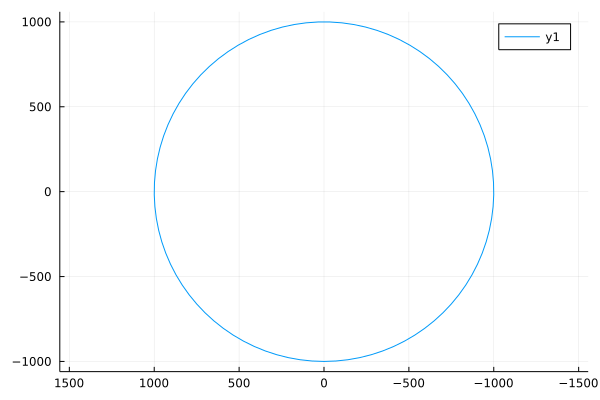
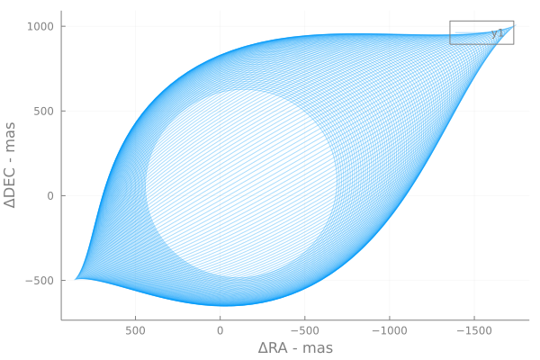

# Plotting

This package defines a Plots.jl recipe for [`KeplerianElements`](@ref).

Example:
```julia
elems = KeplerianElementsDeg(
    a = 1.0,
    M = 1.0,
    i = 0,
    e = 0,
    ω = 0,
    Ω = 0,
    plx = 1000,
    τ = 0,
)

plot(elems)
```



The orbit described by the elements is traced out automatically in equal steps of true anomaly (ν) which gives a smooth curve regardless of eccentricity.

The plot recipe sets the axes to have default aspect ratios and flips the right-ascension (horizontal) axis to increasing towards the left as it does when viewed in the plane of the sky.


## Plotting multiple orbits
If you have an array of Keplerian orbits, you can plot them all in one go:
```julia
elements = [KeplerianElementsDeg(a=16+0.3i, i=i, e=0.25+0.001i, τ=0, μ=1, ω=0, Ω=120, plx=35) for i in 1:1:90]
plot(elements)
```
This recipe scales down the opacity slightly so that you can see where the orbits overlap. Override by passing `alpha=1`.


