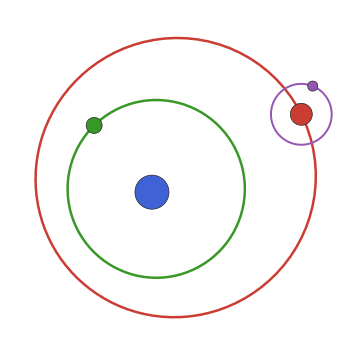

# Plotting

PlanetOrbits has a [Makie](https://docs.makie.org) extension. Install a Makie
backend — `CairoMakie` for publication-quality static figures, `GLMakie` for
an interactive window — and the extension loads itself alongside it. There is
no separate plotting package to add.

```@example plots
using PlanetOrbits
import PlanetOrbits as PO
using CairoMakie
nothing # hide
```

The extension is deliberately small. It adds four things — quick-look plots,
phase-coloured orbit tracks, calendar-date epoch axes, and a house theme — and
then gets out of the way. Everything past that is plain Makie applied to the
observables from [Introduction](@ref), so anything you can draw with Makie you
can draw here.

A system to work with: a 10-Jupiter-mass companion on a moderately eccentric,
inclined orbit around a 1.1 M⊙ star at 40 pc (`plx = 25` mas).

```@example plots
A = PO.Body(mass=1.1, name=:A)
b = PO.Body(mass=10mjup, name=:b)

sys = PO.System((A, b), (
    PO.Orbit(b, about=A; a=8.0, e=0.35, i=0.9, ω=1.1, Ω=2.2, tp=58849.0),
); plx=25.0)
```

## Quick looks

`lines` and `scatter` accept a system plus the two references you want the
track of, in the same `(of, relative_to)` order the observables use:

```@example plots
lines(sys, :b, :A)
```

For a two-body system there is only one thing that could be meant, so the
references can be dropped:

```@example plots
lines(sys)
```

The track is the full closed orbit, sampled by
[`orbit_track_epochs`](@ref) (see [Choosing epochs](@ref) below). Angular
observables are used when the system has a parallax and physical ones (AU)
when it does not — so a frameless system plots in AU without further ceremony.

These quick looks are meant for the REPL, and are deliberately unopinionated:
they set no axis labels and do not flip the RA axis. For a figure you intend to
keep, use `orbitlines!`.

## Orbit tracks

[`orbitlines!`](@ref) draws the same track onto an axis you control, coloured
by orbital phase, and sets the sky-plane orientation for you (right ascension
increasing to the left):

```@example plots
fig = Figure(size=(560, 460))
ax = Axis(fig[1, 1];
    xlabel=plotlabel(raoff), ylabel=plotlabel(decoff),
    aspect=DataAspect())

p = orbitlines!(ax, sys, :b, :A)
scatter!(ax, [0], [0]; marker='★', markersize=22, color=:goldenrod)

Colorbar(fig[1, 2], p; label="orbital phase [rad]")
fig
```

The colour is mean-anomaly phase, running from `0` at periastron round to `2π`
one period later. Because phase advances uniformly in *time*, the colour is a
direct readout of where the companion is at a given fraction of its period —
the gradient is stretched out over the slow, wide part of the orbit and
compressed near periastron, and the abrupt colour change marks periastron
itself. Pass `colorbyphase=false` for a plain line, and any other keyword
through to `lines!`.

`plotlabel` supplied those axis labels — see [Labels and units](@ref).

## The house theme

[`orbit_theme`](@ref) is the look used across PlanetOrbits and Octofitter
figures. It is intentionally minimal — it turns grid lines off and leaves
everything else to Makie, so it composes with your own theme rather than
overriding it.

```@example plots
with_theme(orbit_theme()) do
    fig = Figure(size=(560, 300))
    ax = Axis(fig[1, 1]; xlabel=plotlabel(raoff), ylabel=plotlabel(decoff))
    orbitlines!(ax, sys, :b, :A; colorbyphase=false, color=:black)
    fig
end
```

Use `set_theme!(orbit_theme())` to apply it for a whole session.

## Time axes

Orbital epochs are Modified Julian Days, which nobody reads at a glance.
[`MJDConversion`](@ref) is a Makie dimension conversion: the data stay plain
`Float64` MJDs, but the ticks are calendar dates, recomputed as you zoom.

```@example plots
epochs = plot_epochs(sys, mjd("2020-01-01"), mjd("2050-01-01"))
traj = orbitsolve(sys, epochs)
rv = [radvel(sol, :A, barycentre(sys)) for sol in traj]

fig = Figure(size=(700, 300))
ax = Axis(fig[1, 1]; ylabel=plotlabel(radvel), dim1_conversion=MJDConversion())
lines!(ax, epochs, rv)
fig
```

That is the star's reflex velocity about the system barycentre — the quantity
a radial-velocity survey measures.

`Date` and `DateTime` values plot straight into such an axis. The exception is
the single-argument helpers `vlines!` and `hlines!`, which bypass Makie's
dimension conversions entirely; convert those yourself with `mjd`:

```@example plots
vlines!(ax, mjd("2035-06-01"); color=:firebrick, linestyle=:dash)
fig
```

If you also want the raw numbers, [`add_mjd_axis!`](@ref) adds a companion
axis in the same layout cell, linked to the first:

```@example plots
add_mjd_axis!(fig[1, 1], ax; position=:top)
fig
```

## Choosing epochs

Two helpers generate epoch grids, and they answer different questions.

[`orbit_track_epochs`](@ref) traces **one closed orbit**, spaced uniformly in
eccentric anomaly rather than in time. That puts points where the curvature is
— densely around periastron, sparsely at apastron — so a highly eccentric
track stays smooth with far fewer points than uniform time sampling would need:

```@example plots
ecc = PO.System((A, b), (
    PO.Orbit(b, about=A; a=6.0, e=0.85, i=0.0, ω=0.0, Ω=0.0, tp=58849.0),
); plx=25.0)

n = 40
ts_ea = orbit_track_epochs(ecc; n)
ts_t = range(periastron(ecc), periastron(ecc) + period(ecc), length=n)

fig = Figure(size=(700, 340))
for (j, (ts, title)) in enumerate(((ts_ea, "uniform eccentric anomaly"),
                                   (ts_t, "uniform time")))
    ax = Axis(fig[1, j]; title, aspect=DataAspect(), xreversed=true)
    hidedecorations!(ax)
    t = orbitsolve(ecc, collect(ts))
    xs = [raoff(s, :b, :A) for s in t]
    ys = [decoff(s, :b, :A) for s in t]
    lines!(ax, xs, ys; color=:grey)
    scatter!(ax, xs, ys; markersize=6)
end
fig
```

Both panels use 40 points. Uniform time spends nearly all of them on the slow
outer arc and cuts the periastron passage into a corner.

[`plot_epochs`](@ref) answers the other question — sampling a **span of time**
for a model curve, as the radial-velocity figure above did. It allocates
points per hierarchy row, so a short-period inner orbit is resolved without
inflating the grid for a wide outer one:

```@example plots
length(plot_epochs(sys, mjd("2020-01-01"), mjd("2050-01-01")))
```

[`orbit_phase`](@ref) gives the mean-anomaly phase of a row at an epoch, in
`[0, 2π)`; it is what `orbitlines!` colours by, and what you want for
phase-folding radial velocities.

```@example plots
orbit_phase(sys, mjd("2035-06-01"))
```

Unbound orbits have no period, so `orbit_track_epochs` and `orbit_phase` have
nothing to close or fold; sample a time span with `range` instead.

## Labels and units

[`plotinfo`](@ref) is a small resolver table mapping each observable function
to how it should be displayed. It carries no dependency on any plotting
package, which is why the Makie extension, Octofitter's plot layer, and your
own scripts can all share it instead of each keeping a private dictionary of
axis labels.

```@example plots
plotinfo(posangle)
```

`flip` marks the RA-like axes that increase leftward on the sky; `wrap` marks
the quantities that live on a circle. [`plotlabel`](@ref) is the common case,
rendering `label` and `unit` into an axis label:

```@example plots
plotlabel.((raoff, decoff, radvel, projectedseparation))
```

[`paraminfo`](@ref) is the equivalent table for *parameters* rather than
observables — the element keywords `Orbit` accepts, plus frame variables. It
is what corner plots and posterior summary tables label their axes from, and
it flags the radian-valued parameters that are conventionally displayed in
degrees:

```@example plots
(paraminfo(:a), paraminfo(:Ω))
```

`paraminfo` returns `nothing` for a name it does not know, so a caller can
fall back to the bare symbol.

## Many orbits at once

There is no special API for plotting a family of orbits — posterior draws, a
grid of trial inclinations — because plain Makie already handles it. Build the
systems and draw them onto one axis:

```@example plots
fig = Figure(size=(460, 460))
ax = Axis(fig[1, 1]; xlabel=plotlabel(raoff), ylabel=plotlabel(decoff),
          aspect=DataAspect(), xreversed=true)

for i in range(0.0, π/2, length=14)
    s = PO.System((A, b), (
        PO.Orbit(b, about=A; a=8.0, e=0.35, i=i, ω=1.1, Ω=2.2, tp=58849.0),
    ); plx=25.0)
    lines!(ax, s; color=(:steelblue, 0.4))
end
scatter!(ax, [0], [0]; marker='★', markersize=22, color=:goldenrod)
fig
```

Reduced opacity is worth doing by hand here: overlap density is the thing you
actually want to read off a posterior draw plot.

## Animation

Makie's `record` needs a trajectory and a loop:

```@example plots
ts = orbit_track_epochs(sys; n=90)
traj = orbitsolve(sys, ts)
xs = [raoff(s, :b, :A) for s in traj]
ys = [decoff(s, :b, :A) for s in traj]

fig = Figure(size=(400, 400))
ax = Axis(fig[1, 1]; aspect=DataAspect(), xreversed=true,
          xlabel=plotlabel(raoff), ylabel=plotlabel(decoff))
lines!(ax, xs, ys; color=:grey)
scatter!(ax, [0], [0]; marker='★', markersize=22, color=:goldenrod)

pos = Observable([Point2f(xs[1], ys[1])])
scatter!(ax, pos; markersize=14, color=:steelblue)

record(fig, "orbit-animation.mp4", eachindex(ts); framerate=30) do k
    pos[] = [Point2f(xs[k], ys[k])]
end
nothing # hide
```

```@raw html
<video src="orbit-animation.mp4" autoplay loop muted width=400 height=400>
```

Because the epochs are uniform in eccentric anomaly rather than in time, this
animation plays at a constant *phase* rate; loop over `range(t0, t0+period(sys),
length=n)` instead if you want real time, and the companion will visibly
accelerate through periastron.

## The logo

The package logo is generated by
[`docs/logo.jl`](https://github.com/sefffal/PlanetOrbits.jl/blob/master/docs/logo.jl),
which is a compact worked example of most of this page: quick-look tracks, a
manually placed moon track from `orbit_track_epochs`, and plain Makie
composition on top.


